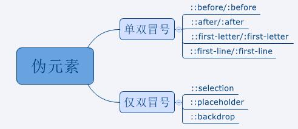
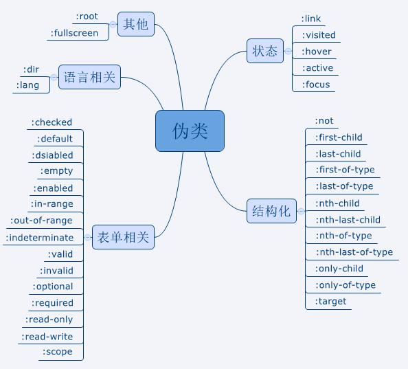

## 伪类和伪元素
- 伪类与伪元素都是用于向选择器加特殊效果
- 本质区别是是否抽象创造了新元素
- 伪类只能使用":"，伪元素可以使用"::"和":"
- 伪类只要不是互斥可以叠加使用，如div:first-child:hover,但注意这里是“与”的关系，既要满足first-child第一个子元素，又要满足hover光标悬浮
- 伪元素在一个选择器中只能出现一次，并且只能出现在末尾
- 伪类与伪元素优先级分别与类、标签优先级相同

