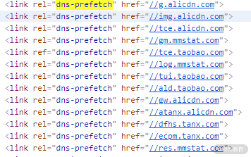

## "看不见"的html标签

1. meta标签：自动刷新/跳转
```
<!-- 5s后自动跳转到同域下的 page2.html -->
<meta http-equiv="Refresh" content="5; URL=page2.html">

<!-- 每隔1分钟刷新页面的大屏幕监控 -->
<meta http-equiv="Refresh" content="60">
```

- 刷新和跳转操作是不可取消的，对于刷新时间间隔或需要手动取消的，还是推荐定时器
- 适用于只想实现页面的定时刷新或跳转，比如某些页面缺乏访问权限，在x秒后跳回首页

2. title标签与Hack手段：消息提醒
- B/S架构优点： 版本更新方便、 跨平台、跨终端
- 缺点： 即时通信场景时， 比较麻烦

### 即时通信
- 因为前后端通信深度依赖HTTP协议，而HTTP协议采用“请求-响应”模式，这就决定了服务端只能被动发送数据。
- 一种低效的解决方案是客户端通过轮询机制获取最新消息
- HTML5下可以使用WebSocket 协议

### 消息提醒功能
- HTML5之前浏览器没有开放图标闪烁、弹出系统消息之类的接口
- 只能借助一些Hack手段，比如修改title标签来达到类似的效果
- HTML5 下可使用 Web Notifications API 弹出系统消息
```
<!-- 通过定时修改title标签内容，模拟类似消息提醒的闪烁效果 -->
let msgNum = 1; // 消息条数
let cnt = 0; // 计数器
const interval = setInterval(() => {
    cnt = (cnt + 1) % 2
    if (msgNum === 0) {
        // 通过DOM修改title
        document.title += '聊天页面'
        clearInterval(interval)
        return
    }
    const prefix = cnt % 2 ? `新消息(${msgNum})` : ''
    document.title = `${prefix}聊天页面`
}, 1000)
```

3. 性能优化- script标签：调整加载顺序提升渲染速度
- async属性：立即请求文件，但不阻塞渲染引擎，而是文件加载完毕后阻塞渲染引擎并立即执行文件内容
- defer属性：立即请求文件，但不阻塞渲染引擎，等到解析完HTML之后再执行文件内容
- HTML5标准 type属性，对应值为"module"。让浏览器按照ECMA Script 6标准将文件当作模块进行解析，默认阻塞效果同defer，也可以配合async在请求完成后立即执行


4. 性能优化- link标签：通过预处理提升渲染速度
- dns-prefetch: 浏览器会对某个域名预先进行DNS解析并缓存。当浏览器在请求同域名资源的时候，能省去从域名查询IP的过程，从而减少时间损耗。
- preconnect：让浏览器在一个HTTP请求正式发给服务器前预先执行一些操作，这包括DNS解析、TLS协商、TCP握手，通过消除往返延迟来为用户节省时间
- prefetch/preload：两个值都是让浏览器预先下载并缓存某个资源，但不同的是，prefetch可能会在浏览器忙时被忽略，而preload一定会被预先下载
- prerender：浏览器不仅会加载资源，还会解析执行页面，进行预渲染。


