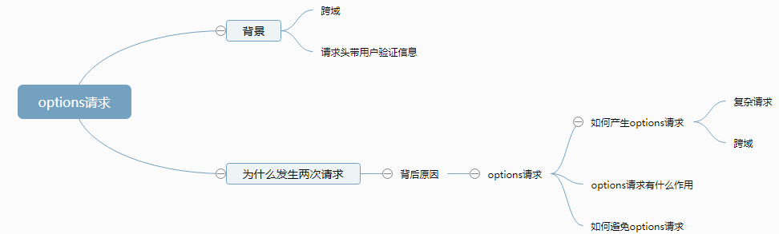

## HTTP options请求方法
- https://www.cnblogs.com/mamimi/p/10602722.html
- https://www.cnblogs.com/zhaodagang8/p/11275685.html

### options请求
- 用于请求获得 由 Request-URI 标识的资源 在请求/响应的通信过程中 可以使用的功能选项。
- 通过这个方法，客户端可以在采取具体资源请求之前，决定对该资源采取何种必要措施，或者了解服务器的性能。
- 白话说就是：在发生正式的请求之前，先进行一次预检请求。服务端返回一些信息，浏览器拿到之后，看后台是否允许进行访问。

### 产生OPTIONS请求的原因
1. 产生了复杂请求
2. 发生了跨域

### 简单请求
1. 请求方法是GET、HEAD或者POST
2. 当请求方法是POST时，Content-Type必须是 application/x-www-form-urlencoded、multipart/form-data 或者 text/plain 中的一个值
3. 请求中没有自定义HTTP头部，如token

### options请求的作用
- 真实请求在options请求中，通过request-header将 Access-Control-Request-Headers与Access-Control-Request-Method发送给后台，另外浏览器会自行加上一个Origin请求地址。
- 服务端在接收到预检请求后，根据资源权限配置，在response-header头部加入access-control-allow-headers（允许跨域请求的请求头）、access-control-allow-methods（允许跨域请求的请求方式）、access-control-allow-origin（允许跨域请求的域）。
- 另外，服务端还可以通过Access-Control-Max-Age来设置一定时间内无须再进行预检请求，直接用之前的预检请求的协商结果即可。
- 浏览器再根据服务端返回的信息，进行决定是否再进行真实的跨域请求。这个过程对于用户来说，也是透明的。
- 另外在HTTP响应头，凡是浏览器请求中携带了身份信息，而响应头中没有返回Access-Control-Allow-Credentials: true的，浏览器都会忽略此次响应。
- 总结：只要是带自定义header的跨域请求，在发送真实请求前都会先发送OPTIONS请求，浏览器根据OPTIONS请求返回的结果来决定是否继续发送真实的请求进行跨域资源访问。

### options请求如何避免
1. 使用代理，避开跨域。
2. 将复杂跨域请求更改为简单跨域请求。
3. 不使用带自定义配置的header头部。