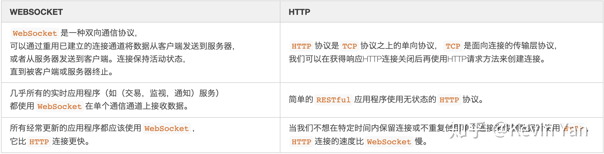

## websocket和http区别及联系

### 联系
- WebSocket和HTTP都是基于TCP协议的两个不同的协议
- WebSocket依赖于HTTP连接

### 区别
- https://zhuanlan.zhihu.com/p/113286469

- websocket是一种双向通信协议，可以通过重用已建立的连接通道将数据从客户端发送到服务器，或者从服务器发送到客户端。连接保持活动状态，知道被客户端或服务器终止。
- 几乎所有的实时应用程序（如交易、监控、通知服务）都使用websocket在单个通信通道上接收数据
- 所有经常更新的应用程序都应该使用websocket，它比http连接更快

- http协议是tcp之上的单向协议，tcp是面向连接的传输层协议，我们可以在获得响应、http连接关闭后再使用http请求方法来创建连接
- 简单的restful应用程序使用无状态的http协议
- 当我们不想在特定时间内保留连接或不重复使用单个连接来传输数据时使用http，http连接的速度比websocket慢