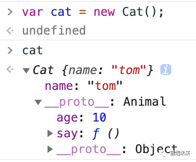

- https://www.jianshu.com/p/72156bc03ac1
## 原型(对象属性)
- Javascript规定，每一个函数都有一个prototype对象属性，指向另一个对象（原型链上面的）。
- prototype(对象属性)的所有属性和方法，都会被构造函数的实例继承。这意味着，我们可以把那些不变(公用)的属性和方法，直接定义在prototype对象属性上。
- prototype就是调用构造函数所创建的那个实例对象的原型（proto）。
- prototype可以让所有对象实例共享它所包含的属性和方法。也就是说，不必在构造函数中定义对象信息，而是可以直接将这些信息添加到原型中。

## 原型链
- 每个函数都拥有一个prototype属性，每个函数实例对象都拥有一个__proto__属性，而这个属性指向了函数的prototype
- 当我们访问实例对象的属性或者方法时，会先从自身构造函数中查找，如果没有就通过__proto__去原型中查找，这个查找的过程我们称之为原型链。
```
// 定义动物 - 父类
function Animal() {
    this.age = age;
    this.say = function () {
        return 'hello tom';
    }
}
// 定义猫 - 子类
function Cat() {
    this.name = 'tom'
}
// 通过原型继承动物类
Cat.prototype = new Animal()
// 实例化一个cat对象
var cat = new Cat();
// 打印返回true
cat.__proto__ === Cat.prototype
// 打印age，会先查找cat，再查找Animal
console.log(cat.age)
```


## 通过截图，我们可以看到cat实例对象__proto__指向了Animal
## 当cat没有age的时候，会通过__proto__到原型上查找
## 如果原型上依然没有，会继续向Object上查找
