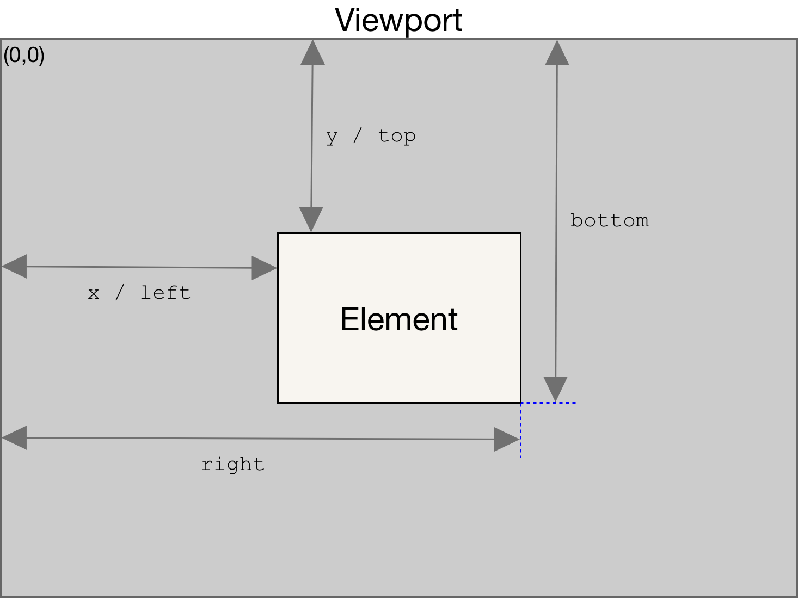

## js获取元素尺寸、位置等信息

### Element.getBoundingClientRect()
- https://developer.mozilla.org/en-US/docs/Web/API/Element/getBoundingClientRect
- 返回元素大小及其相对视口的位置
- 如果是标准盒子模型，元素的尺寸等于width/height + padding + border-width的总和。如果box-sizing: border-box，元素的的尺寸等于 width/height。

```
// rect 是一个具有四个属性 left、top、right、bottom 的 DOMRect 对象
//译者注：DOMRect 是 TextRectangle 或 ClientRect 的标准名称，他们是相同的。
var rect = obj.getBoundingClientRect();
```
