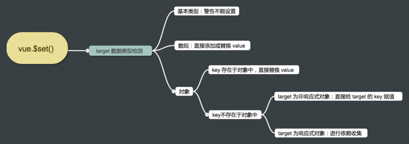

## vue的$set, 修改数组/对象, 底层做了什么
- https://segmentfault.com/a/1190000020659895



- 基本类型不能设置 isUndef(target) || isPrimitive(target)
- 数组：调用splice 添加或修改 val : target.splice(key, 1, val)
- 对象：属性存在于对象中，直接替换val：target[key] = val
- 属性不存在于对象中
    - target非响应式对象(target.\_\_ob\_\_)，直接给target的key赋值 target[key] = val
    - target响应式对象，使用defineReactive将新增属性转换成getter/setter形式，然后向target的依赖发送变化通知(ob.dep.notify())，并返回val

```
function set(target: Array<any> | Object, key: any, val: any): any {
  // isUndef 是判断 target 是不是等于 undefined 或者 null 。
  //isPrimitive 是判断 target 的数据类型是不是 string、number、symbol、boolean 中的一种
  if (process.env.NODE_ENV !== 'production' &&
    (isUndef(target) || isPrimitive(target))
  ) {
    warn(`Cannot set reactive property on undefined, null, or primitive value: ${(target: any)}`)
  }

  // 数组的处理
  if (Array.isArray(target) && isValidArrayIndex(key)) {
    target.length = Math.max(target.length, key)
    target.splice(key, 1, val)
    return val
  }

  // 对象，并且该属性原来已存在于对象中，则直接更新
  if (key in target && !(key in Object.prototype)) {
    target[key] = val
    return val
  }

  // vue给响应式对象(比如 data 里定义的对象)都加了一个 __ob__ 属性，
  // 如果一个对象有这个 __ob__ 属性，那么就说明这个对象是响应式对象，我们修改对象已有属性的时候就会触发页面渲染。
  // 非 data 里定义的就不是响应式对象。
  const ob = (target: any).__ob__

  if (target._isVue || (ob && ob.vmCount)) {
    process.env.NODE_ENV !== 'production' && warn(
      'Avoid adding reactive properties to a Vue instance or its root $data ' +
      'at runtime - declare it upfront in the data option.'
    )
    return val
  }

  // 不是响应式对象
  if (!ob) {
    target[key] = val
    return val
  }

  // 是响应式对象，进行依赖收集
  defineReactive(ob.value, key, val)

  // 触发更新视图
  ob.dep.notify()
  return val
}
```

