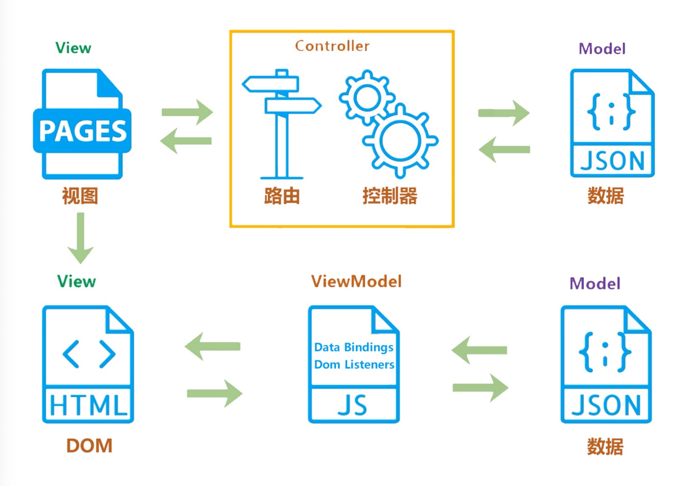

## 谈一下对MVVM原理的理解

### 传统的MVC指的是，用户操作会请求服务端路由，路由会调用对应的控制器来处理，控制器会获取数据。将结果返回给前端，页面重新渲染。

### MVVM：传统的前端会将数据手动渲染到页面上，MVVM模式不需要用户手动操作dom元素，将数据绑定到viewModel层上，会自动将数据渲染到页面中，视图变化会通知viewModel层更新数据。

### ViewModel 就是我们MVVM模式中的桥梁。