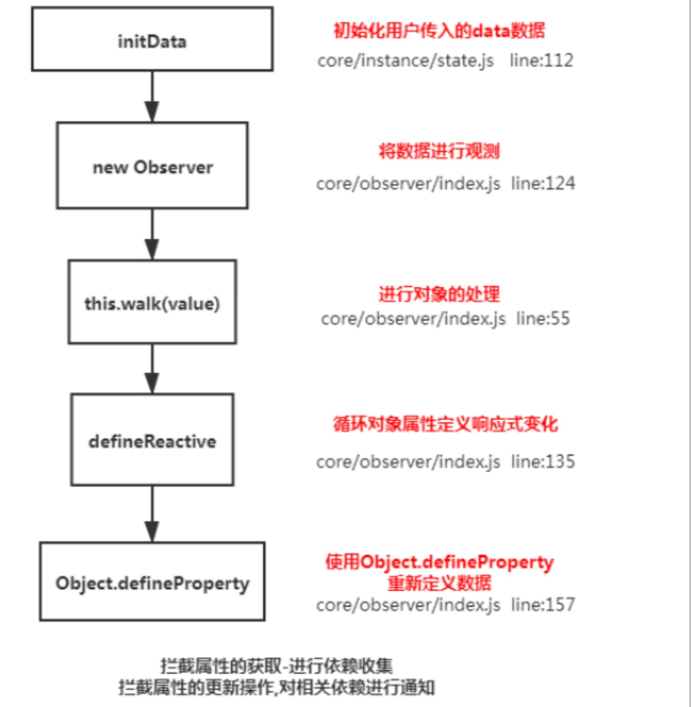

## 说一下响应式数据的原理

## 理解
- 核心点：Object.defineProperty
- 默认Vue在初始化数据时，会给data中的属性使用Object.defineProperty重新定义所有属性，当页面获取对应属性时，会进行依赖收集（收集当前组件的watcher），如果属性发生变化会通知相关依赖进行更新操作。

## 原理


```
Object.defineProperty(obj,key,{
    enumerable: true,
    configurable: true,
    get: function reactiveGetter() {
        const value = getter ? getter.call(obj) : val
        if(Dep.target) {
            dep.depend() /** 收集依赖 **/
            if(childOb) {
                childOb.dep.depend()
                if(Array.isArray(value)) {
                    dependArray(value)
                }
            }
        }
        return value
    },
    set: function reactiveSetter(newVal) {
        const value = getter ? getter.call(obj) : val
        if(newVal === value || (newVal !== newVal && value !== value)){//NaN??
            return
        }
        if(process.env.NODE_ENV !== 'production' && customSetter) {
            customSetter()
        }
        val = newVal
        childOb = !shallow && observe(newVal)
        dep.notify() /** 通知相关依赖进行更新 **/
    }
})
```