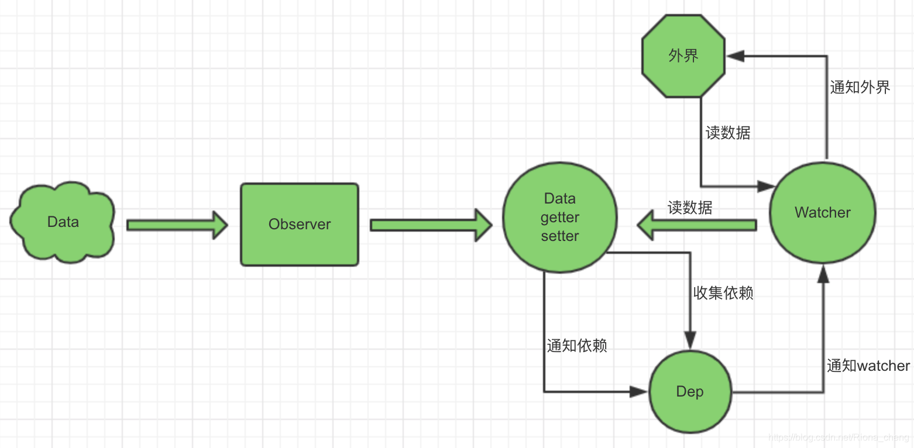

## vue中是如何检测对象变化的？
- https://blog.csdn.net/Riona_cheng/article/details/102882160


- 初始化数据Data通过Observer转换成了 getter/setter 的形式来追踪变化。
- 当外界通过 Watcher 读取数据时（watcher订阅的数据），会触发getter将watcher添加到依赖中。
- 当订阅的数据发生变化时，会触发setter，向Dep中的依赖（watcher）发送通知。
- Watcher 接收到通知后，会向外界发送通知，触发视图的更新。

### 侦测对象变化的方法
1. Object.definePropery
- 在getter中收集依赖，在setter中触发依赖
2. ES6 proxy

### Object.defineProperty缺陷
- 无法侦测数组变化
- 对于多层的对象，需要使用递归进行侦测，多层递归会影响性能
- 没办法对新增、删除的属性进行侦测

### 不能检测对象属性的添加或删除
#### 添加属性
1. 利用Vue.set(object, key, value)
```
Vue.set(vm.obj, "sex", "man")
```
2. 利用this.$set(this.object, key, value)
```
this.$set(this.object, "sex", "man")
```
3. 利用Object.assign({}, this.obj)
```
this.obj.sex = "man";
this.obj = Object.assign({}, this.obj)

// or
this.obj = Object.assign({}, this.obj, {"sex": "man"})
``` 

#### 删除属性
- this.$delete(this.mainData.test, "boolean")
