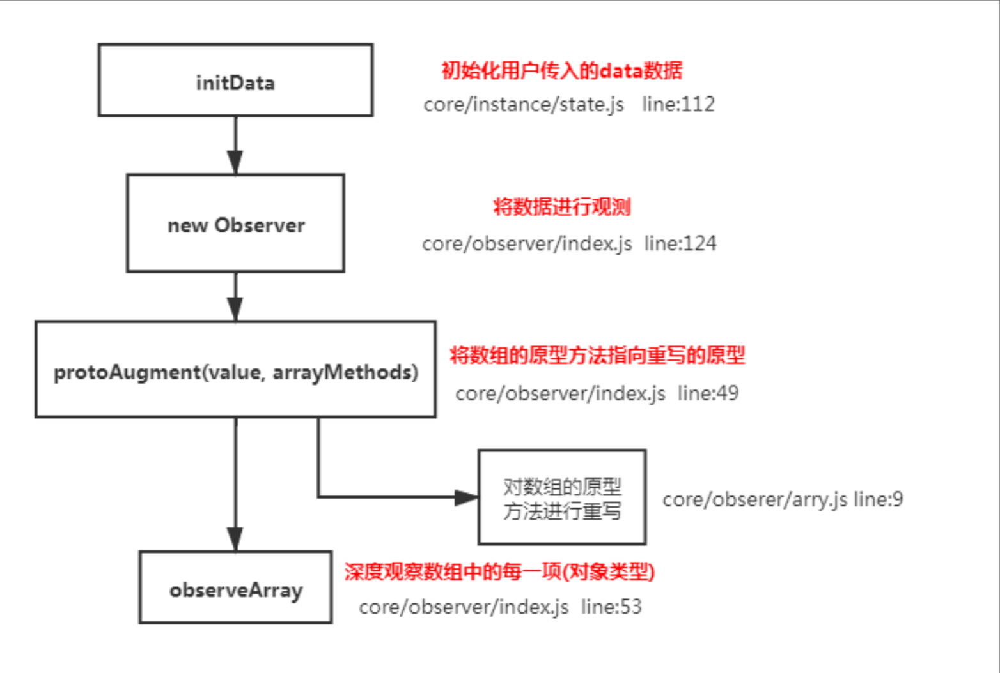

## vue中是如何检测数组变化的？

## 理解：
### 使用函数劫持的方式，重写了数组的方法
### Vue中将data中的数组，进行了原型链重写。指向了自己定义的数组原型方法，这样当调用数组api时，可以通知依赖更新。如果数组中包含着引用类型，会对数组中的引用类型再次进行监控。

## 原理：

```
const arrayProto = Array.prototype
export const arrayMethods = Object.create(arrayProto)
const methodsToPatch = [
    'push',
    'pop',
    'shift',
    'unshift',
    'splice',
    'sort',
    'reverse'
]
methodsToPatch.forEach(function(method) {// 重写原型方法
    const original = arrayProto[method] // 调用原数组的方法
    def(arrayMethods, method, function mutator(...args) {
        const result = original.applay(this, args)
        const ob = this.__ob__
        let inserted
        switch (method) {
            case 'push':
            case 'unshift':
                inserted = args
                break;
            case 'splice':
                inserted = args.slice(2)
                break;
        }

        if(inserted) ob.observeArray(inserted)
        // notify change
        ob.dep.notify() // 当调用数组方法后，手动通知视图更新
        return result
    })
})
this.observeArray(value) // 进行深度监控
```

### 修改数组内容
- splice
- $set
- 扩展运算符 浅拷贝 重新赋值
